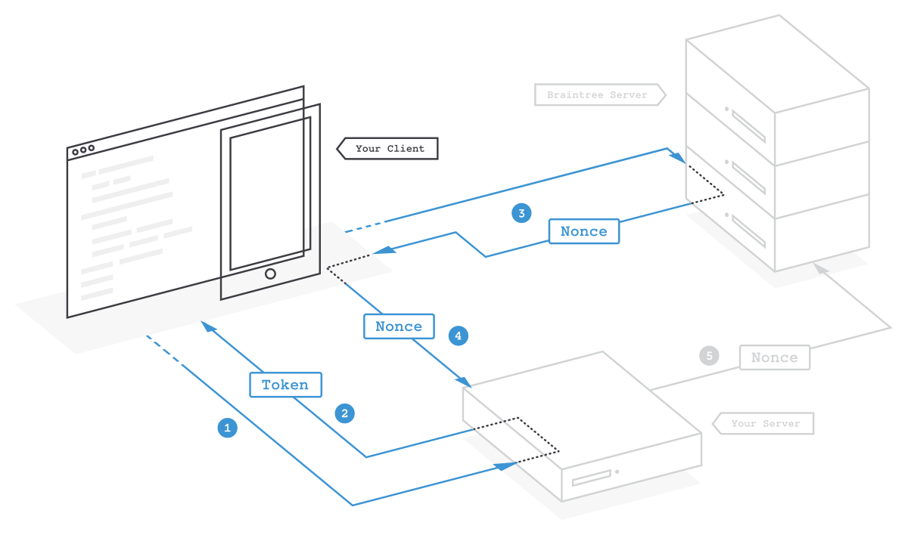
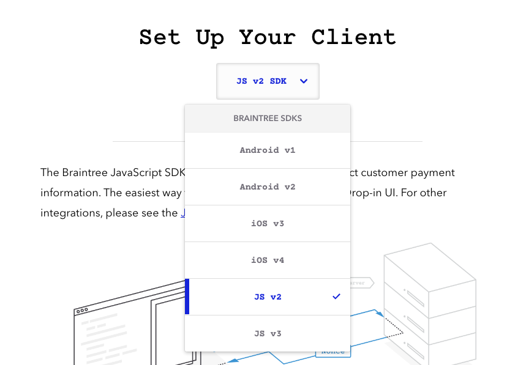
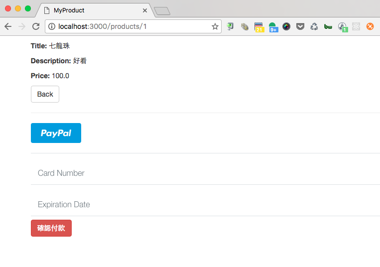
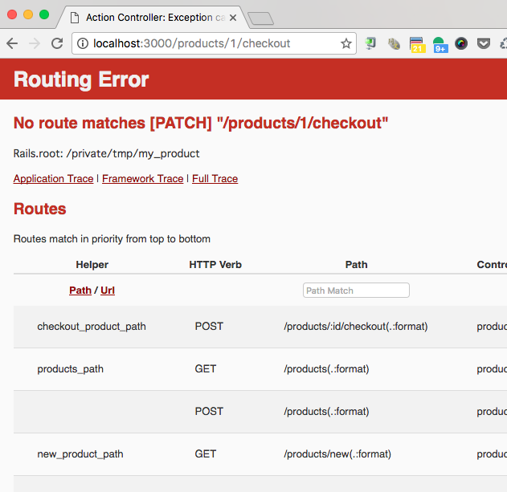
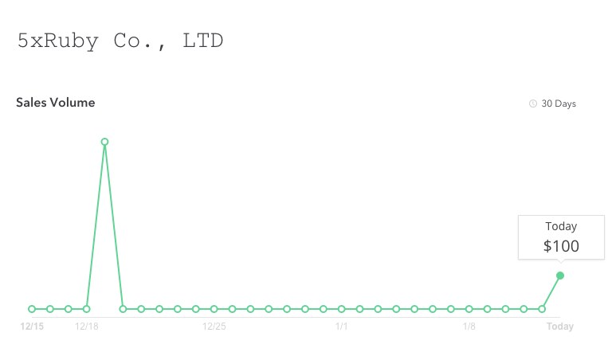

# 金流串接(使用 Paypal)

- [使用 Braintree - 前端](#front-end)
- [使用 Braintree - 後端](#back-end)

有購物車、有訂單處理，接下來就是準備要你的客人付錢了。國內、外的金流廠商有非常多，本章節將以 Paypal 為例，示範如何串接金流。一般來說，國外的金流服務在串接上是比較簡單的，不僅設計比較先進，文件也比較清楚。但不管是要串接哪一家的金流，文件是一定都得要看的。

我們將使用 Braintree 提供的服務來串接 Paypal 金流。

## <a name="front-end"></a>使用 Braintree - 前端

因為我們這是練習用的範例，所以在登入的時候選的是「Sandbox」模式，在這個模式下的任何消費都不會真的刷卡或匯款。登入之後的樣子像這樣：


點擊上方選單的「Help」→「API documentation」，可以在這個頁面查到串接金流服務的所有說明及範例。

使用 Braintree 服務需要在前、後台都做一些設定才能使用，在前端的 `Client SDKs`，選擇 `Web/JavaScript`，整個 Client 端的 SDK 運作原理如它文件上附的這張圖：



說明：

1. 打開瀏覽器，它會先跟網頁伺服器要一組 token，這個伺服器在這裡就是我們的 Rails 專案。
2. 我們的網頁伺服器產生一組 token 給瀏覽器(或手機)。
3. 當在頁面上填完信用卡號以及有效日期後，按下送出，這時候會再跟 Braintree 伺服器要一組 nonce(隨機數)。
4. 瀏覽器取得這組 nonce 後會傳給我們自己的網頁伺服器，然後我們的伺服器就會把所有相關資訊組合成一包資訊傳給 Braintree，進行刷卡。

到這裡是前端頁面在做的事情。但第 2 步因為尚未完成，所以待會這個步驟的資訊會先用假的 token 替代。

要注意的是，目前 Braintree 的 JavaScript 的 SDK 有 v2 跟 v3 兩個版本：



其中 v3 版本較多地方可以客制化，但 v2 版本使用上較為單純，所以以下將使用 v2 版本做為範例，v3 版本的使用方法跟 v2 版不會差太多，使用方式請參閱文件。

為了簡化流程，我直接在商品頁面的 `show` 頁面進行刷卡，我直接在該頁面加上它文件的範例：

```erb
<p id="notice"><%= notice %></p>

<p>
  <strong>Title:</strong>
  <%= @product.title %>
</p>

<p>
  <strong>Description:</strong>
  <%= @product.description %>
</p>

<p>
  <strong>Price:</strong>
  <%= @product.price %>
</p>

<%= link_to 'Back', products_path, class:'btn btn-default' %>
<hr />

<%= form_for(@product, url: checkout_product_path(@product), method: :post) do |f| %>
  <div id="payment-form"></div>
  <%= f.submit "確認付款", class:"btn btn-default btn-danger" %>
<% end %>

<script src="https://js.braintreegateway.com/js/braintree-2.30.0.min.js"></script>
<script>
var clientToken = "eyJ2ZXJzaW9uIjoyLCJhdX...[略]...";

braintree.setup(clientToken, "dropin", {
  container: "payment-form"
});
</script>
```

說明：

1. Form 裡面必須有一個 id 為 `payment-form` 的元素，好讓底下的 JavaScript 可以對到這個名字。不一定要用這個名字，但如果改的話，底下的 `braintree.setup` 那段範例裡的名字也要跟著改。
2. 文件的範例只是一般的 HTML form，但在 Rails 傳送表單的時候會檢查 CSRF Token，所以通常會用 `form_for` 或 `form_tag` 來產生 HTML form。
3. 接續 2，為了讓 `form_for` 裡的 `checkout_product_path` 可以正常運作，我在 `config/routes.rb` 加了一些修改：

```ruby
Rails.application.routes.draw do
  resources :products do
    member do
      post :checkout
    end
  end
end
```

重新整理頁面，這時候的畫面會變成這樣：



### 測試卡號

Braintree 有提供一組測試用的卡號：

卡號：4111-1111-1111-1111 (第一個 4，剩下按 1 按到底)
日期：只要超過今天的日期就行了

填完卡號以及有效期限按下送出後，沒意外的話應該會看到這個錯誤畫面：



那是因為我們還沒有寫這個 `checkout` Action，所以有這個錯誤訊息是正常的。到這裡，前端頁面的設定算是完成一部份了。為什麼說一部份? 因為那個 `clientToken` 目前還是寫死的，它應該由我們的伺服器來傳給它才對，這也就是我們下一步要做的事。

## <a name="back-end"></a>使用 Braintree - 後端

後端要做幾件事情：

1. 安裝 `braintree` gem
2. 設定金鑰
3. 產生 `clientToken`
4. 接收到前端頁面 POST 過來的資訊，準備進行刷卡

### 1. 安裝 `braintree` gem

這個步驟還滿簡單的，只要在 Gemfile 裡加上 `gem 'braintree'` 就行了，存檔後記得執行 `bundle install` 指令確定有正確安裝完成。

### 2. 設定金鑰

接下來要設定一些金鑰資訊以便讓我們產生下一步所需的 Client Token。以我們在開發環境為例，請打開 `config/environmentsdevelopment.rb` 檔案，在最下方加上這幾行：

```ruby
Rails.application.configure do
  #...[略]...
  config.file_watcher = ActiveSupport::EventedFileUpdateChecker
end

Braintree::Configuration.environment = :sandbox
Braintree::Configuration.merchant_id = "use_your_merchant_id"
Braintree::Configuration.public_key = "use_your_public_key"
Braintree::Configuration.private_key = "use_your_private_key"
```

其中 `use_your_merchant_id`、`use_your_public_key` 以及 `use_your_private_key` 這三個資訊，請到 Braintree 的上方選單「Account」→「My User」頁面，下方有一個「API Keys, Tokenization Keys, Encryption Keys」段落，裡面可以新增或取得所需的資訊：


> 注意：修改過 `config` 目錄下的檔案，通常都需要重新啟動 `rails server` 才會生效。

### 3. 產生 `clientToken`

回到 ProductsController 的 show Action，加上這行：

```ruby
class ProductsController < ApplicationController
  #...[略]...

  def show
    @client_token = Braintree::ClientToken.generate
  end

  #...[略]...
end
```

產生一個 `@client_token` 的實體變數，準備給 View 使用。然後回到 `show.html.erb` 檔案，把剛剛很長而且寫死的那個 `clientToken` 換成我們剛剛產生的資訊：

```erb
<p id="notice"><%= notice %></p>

<p>
  <strong>Title:</strong>
  <%= @product.title %>
</p>

<p>
  <strong>Description:</strong>
  <%= @product.description %>
</p>

<p>
  <strong>Price:</strong>
  <%= @product.price %>
</p>

<%= link_to 'Back', products_path, class:'btn btn-default' %>
<hr />

<%= form_for(@product, url: checkout_product_path(@product), method: :post) do |f| %>
  <div id="payment-form"></div>
  <%= f.submit "確認付款", class:"btn btn-default btn-danger" %>
<% end %>

<script src="https://js.braintreegateway.com/js/braintree-2.30.0.min.js"></script>
<script>
var clientToken = "<%= @client_token %>";

braintree.setup(clientToken, "dropin", {
  container: "payment-form"
});
</script>
```

這樣就可以準備來刷卡了!

### 4. 接收到前端頁面 POST 過來的資訊，準備進行刷卡

按下送出，這時候它會去找 `checkout` Action，所以我們現在來完成這段功能。當按下送出之後，`checkout` Action 會收到的 `params` 的內容如下：

```ruby
Parameters: {"utf8"=>"✓", "authenticity_token"=>"PdmlFcBf6AmjyNg9bM6nh3wppzdC3xPZGBRmv7NR58DKcYh4DsoV804YKI9pyfU+FyrzzRbh0iq6Tg9K/BL9ZA==", "payment_method_nonce"=>"47571afc-8316-0b1d-1619-24f29754a320", "id"=>"1"}
```

這段資訊裡面我們會需要的是 `payment_method_nonce` 以及 `id`，所以只要截取這兩個資訊出來就行了：

> 你有發現這串 params 裡面沒有「信用卡卡號」嗎?

```ruby
class ProductsController < ApplicationController
  before_action :set_product, only: [:show, :edit, :update, :destroy, :checkout]
  #...[略]...

  def checkout
    if @product
      nonce = params[:payment_method_nonce]

      result = Braintree::Transaction.sale(
        amount: @product.price,
        payment_method_nonce: nonce
      )

      if result
        redirect_to products_path, notice: "刷卡成功"
      else
        # 錯誤處理
      end
    else
      # 錯誤處理
    end
  end

  #...[略]...
end
```

說明：

1. 因為 `checkout` Action 也需要先把要刷卡的那項商品挑出來，所以在 `before_action` 也把它掛上去
2. `Braintree::Transaction.sale` 方法需傳入「金額」以及 Client 頁面傳過來的那個隨機數(nonce)
3. 如果刷卡錯誤需適時的提醒使用者哪裡發生錯誤

如果一切順利，應該就會轉往商品列表頁面了。

這時候回到 Braintree 的後台主頁面，可以看到我們的確刷了 100 塊錢：



## 小結

Braintree 算是相當容易串接的服務，不過在上面的例子我們僅傳了消費金額給 Braintree，事實上在實務上還需要傳更多資訊過去，例如訂單編號等，這樣店家才會知道到底賣了什麼、賣給誰。更多詳細使用方法，請參閱 Braintree 的 API 手冊。

